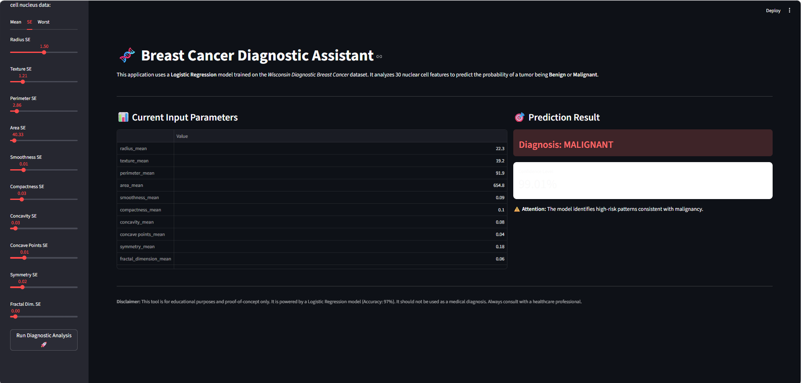
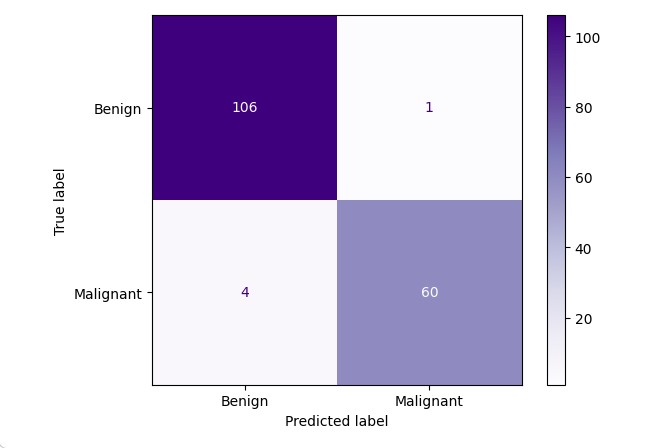

# 🏥 Breast Cancer Diagnostic Assistant: AI-Powered Classification

> **High-reliability Machine Learning pipeline** designed to classify breast tumors as Malignant or Benign with **97.14% Cross-Validation accuracy**. This project demonstrates a rigorous approach to feature interpretability and clinical decision support.

[](https://www.python.org/)
[](https://scikit-learn.org/)
[](https://streamlit.io/)

---

## 🎯 Project Overview
This project develops a diagnostic aid tool using Fine-Needle Aspirate (FNA) biopsy data. In oncology, the challenge isn't just high accuracy, but minimizing **False Negatives**. By comparing multiple architectures and performing exhaustive hyperparameter tuning, this engine delivers a model that balances high precision with the critical need for **high recall**.

### 🖥️ Interactive Dashboard

*Interface built with Streamlit for real-time diagnostic simulation.*

---

## 🏗️ Engineering Pipeline
The data follows a standardized medical-grade preprocessing flow to ensure zero **Data Leakage**:
1.  **Cleaning:** Removal of non-informative features (ID) and handling missing values.
2.  **Strategic Split:** Data split into Training (70%) and Testing (30%) sets **before** scaling.
3.  **Standardization:** Implementation of `StandardScaler` fitted only on training data.
4.  **Optimization:** 5-fold Cross-Validation with `GridSearchCV` across 4 distinct architectures.

---

## 📊 Benchmark & Model Selection
A systematic comparison was conducted using the **best-tuned versions** of each algorithm:

| Algorithm | CV Accuracy | Key Findings |
| :--- | :---: | :--- |
| **Logistic Regression** | **97.14%** | **Most stable & interpretable** |
| KNN (Best k=13) | 96.92% | High performance, sensitive to noise |
| Random Forest | 96.70% | Great for non-linear patterns |
| SVM (Linear) | 96.26% | Solid baseline, slightly lower recall |

---

## 🏆 Final Evaluation & Performance
Testing on the held-out set confirmed the model's high generalization capability. The Confusion Matrix below shows our focus on minimizing False Negatives:



* **Test Accuracy:** 97.08%
* **Recall (Malignant):** **95.24%** *(Primary metric to avoid missed diagnoses)*
* **Precision (Malignant):** 96.77%
* **F1-Score:** 96.00%  

---

## 🔍 Model Interpretability
One of the core features of this project is the analysis of **Feature Importance**. We identify clear morphological patterns that distinguish benign from malignant tumors:

* **Texture Worst:** The most significant indicator in our current model.
* **Radius SE & Area SE:** High variability in tumor size is a strong predictor of malignancy.
* **Concave Points:** Irregular nuclear contours are effectively captured as high-risk patterns.

---

## 🚀 Usage & Deployment
1.  **Clone:** `git clone https://github.com/giuliabugatti09/Breast-Cancer-Prediction.git`
2.  **Install:** `pip install -r requirements.txt`
3.  **Run:** `streamlit run app.py`

---

## 📂 Project Structure
```text
├── models/
│   ├── breast_cancer_model.pkl   # Trained Logistic Regression
│   └── scaler.pkl                # Fitted StandardScaler
├── images/
│   ├── confusion-matrix.png      # Performance visualization
│   └── app.py.png                # Dashboard screenshot
├── data/
│   ├── data (2).csv               #dataset
├── notebooks/
│   └── cancer_prediction.ipynb   # Full EDA and Training pipeline
├── app.py                        # Streamlit Interface
└── requirements.txt              # Dependencies
└── README.MD                     # Documentation project